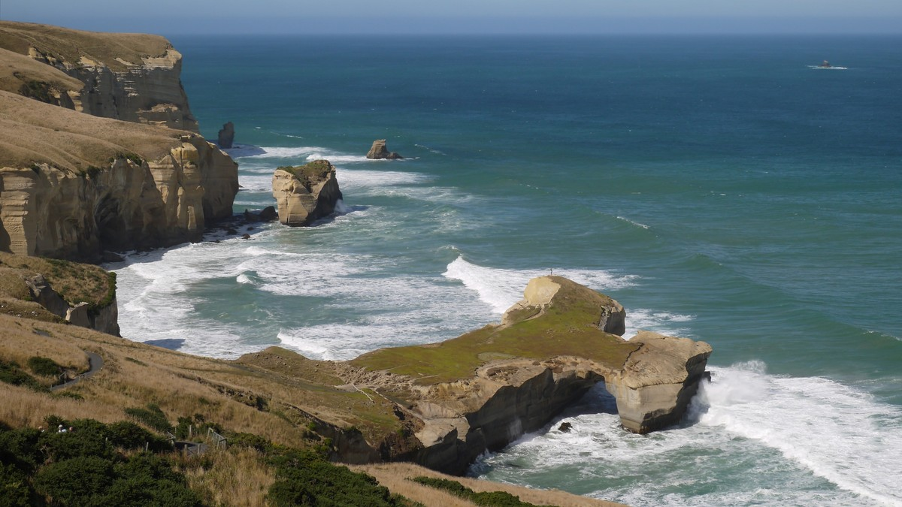

I suppose, I have seen a fair bit of the world — and there really are some beautiful places. But there is one place very special to me: Tunnel beach in New Zealand.

My wife and I have lived in New Zealand for a year. That was in 1997 and 1998. I had just completed my PhD and was now researching and teaching at the University of Dunedin. Dunedin is a little town on the South Island, which was pretty much influenced from Scottish emigrants at the time. We had a great time living in New Zealand. The people are super-friendly and relaxed, there are tons of outdoor activities and the amount of wild life next door is just incredible. Dunedin is right on a beautiful beach and there is always weather.

We loved it so much, we almost decided to stay there. But then, New Zealand is so far away and my wife was pregnant at the time. And also I had a contract with a bank coming up back in Germany. So in the end, we flew back. But Tunnel beach has been special to me. I remember countless hours we have been lying on our backs on this spot that looks like a shoe, enjoying the sun, staring into the sky, or watching the waves. Looking back from today's perspective we were still rather young at the time and dreaming of the future. 

The coast line is quite rough down south, but there actually is a beautiful little beach that you cannot see on the photo. It wouldn't have been accessible, if not for John Cargill who had a tunnel drilled into the sandstone back in the 1870s. The legend says that John Cargill had the tunnel built as a gift for his daughters. 

In 2012, we came back to New Zealand with the whole family of 5 and, of course, visited Tunnel beach. This is when the foto was taken. Tunnel beach has not lost one inch of its beauty and it probably never will.
